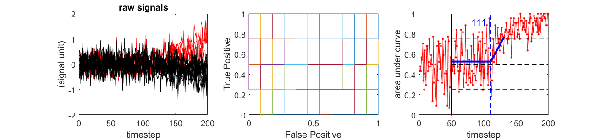

# ROC signal discrimination pipeline

A matlab pipeline to perform Receiver Operating Characteristic analyses.
The ```segmented_linear.m``` function is a modified version of the script found 
<a href="https://journals.physiology.org/doi/suppl/10.1152/jn.00702.2015" alt="link"> here</a>.
I strongly recommend reading the methods of the 
<a href="https://journals.physiology.org/doi/full/10.1152/jn.00702.2015" alt="main">
main article
</a>
it belongs to if you want a more detailed description of 
this analysis technique. 


To get started, feel free to look up ```example_roc.m```. Running this script will output this figure:



